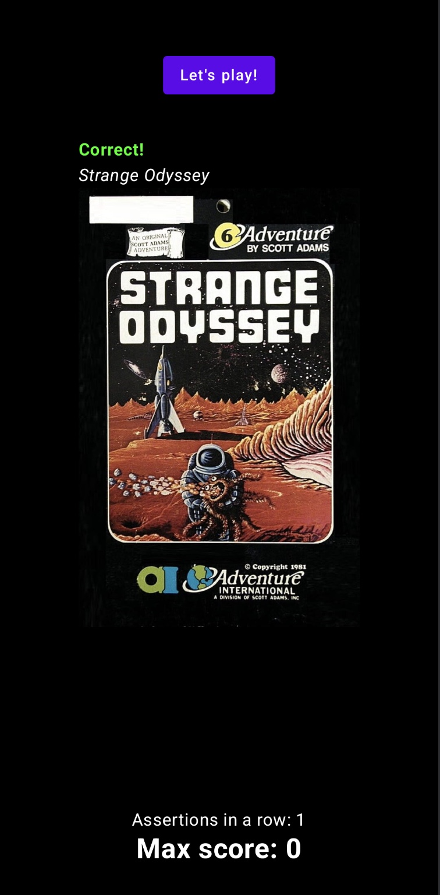

# Guess the game

Guess the game is a small Kotlin Multiplatform project created to practice and learn targeting the same logic to Android and iOS devices.
The objective of the game is to guess as many games as you can in a row based in an in-game picture and four given options.
The device will keep the max score you get.

## How to build

Ensure you have all KMP dependencies installed, follow the [official guidelines](https://www.jetbrains.com/help/kotlin-multiplatform-dev/multiplatform-setup.html) if you haven't yet.
Next step is to set the following secrets based in your [IGDB](https://api-docs.igdb.com/#getting-started) account right into the root of the project:

```local.properties
  - igdb.client_id=`client id`
  - igdb.client_secret=`client secret`
```

You can use [Android Studio](https://developer.android.com/studio) to run the emulators locally.

## Running screens
   